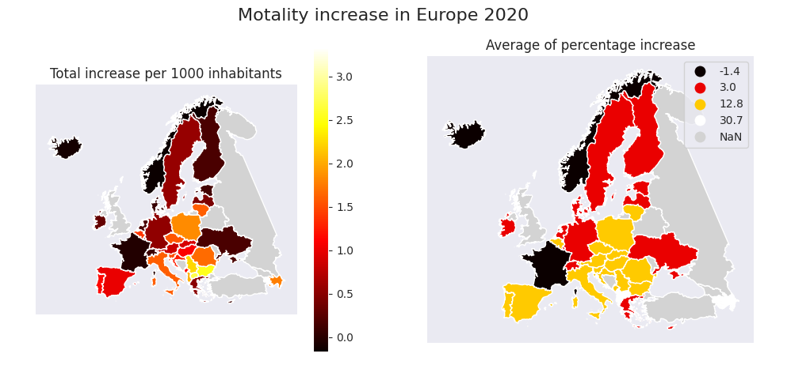

# Covid Mortality analysis

## Introduction
Without any doupt, Covid has hit all of us. But it is questionable, how strong exactly. Of course, 
there is plenty of statistics about number of new cases, tests made and number of deaths. Unfortunatelly, 
used methodologies can vary across countries and therefore results may not be as reliable as we would want,
 or it requires deeper understanding of these methodologies and other factors.

In contrast, mortality could be a simple indicator of success or failure of individual countries. It was 
partially decreased by lock-downs. For example there was 15% less dead car
 [accidents in the Czech republic](https://www.ibesip.cz/getattachment/Statistiky/Statistiky-nehodovosti-v-Ceske-republice/Dopravni-nehodovost-2020/20-12-NSBSP.pdf?lang=cs-CZ) in 2020. And hugely increased by Covid. Apart from deaths caused directly by this disease, it covers cases caused by 
cunctation of needed healthcare, as well.

## Analysis
In the first figure, there are two maps. The left one shows difference in number of deads between average value 2016-2019 and 
2020 in European countries.  The right one division into groups by percentage mortality increase.

Second plot contains total mortality number in 2016-19 and 2020 in each country, which are sorted by percentag eincrease.

Average mortality in EU between years 2016-2019 was 10.0 per 1000 inhabitants, in 2020 it was 10% more (11.0). 
As we can sea, there are three countries with lower count then in past years: Norway, Iceland and France. 

Second group consists of countries from Denmark to Sweden who were able keep the number under 9.5. 
Last group covering rest of EU countries ends with Poland, where number of deaths has increased by 17% to 12.6. 
Czech Republic has slightly better result - 12.6, but still, it is probably not "Best in COVID".

Although, all of us have heard about strong waves in Spain or Italy, the highest mortality occurred in last 
fou European countries: Abania, Macedonia, Azerbajian and Armenia.

## Data source
Map: [leakyMirror](https://github.com/leakyMirror/map-of-europe)  
Mortality: [eurostat](https://ec.europa.eu/eurostat/web/gisco/geodata/reference-data/administrative-units-statistical-units/countries)
